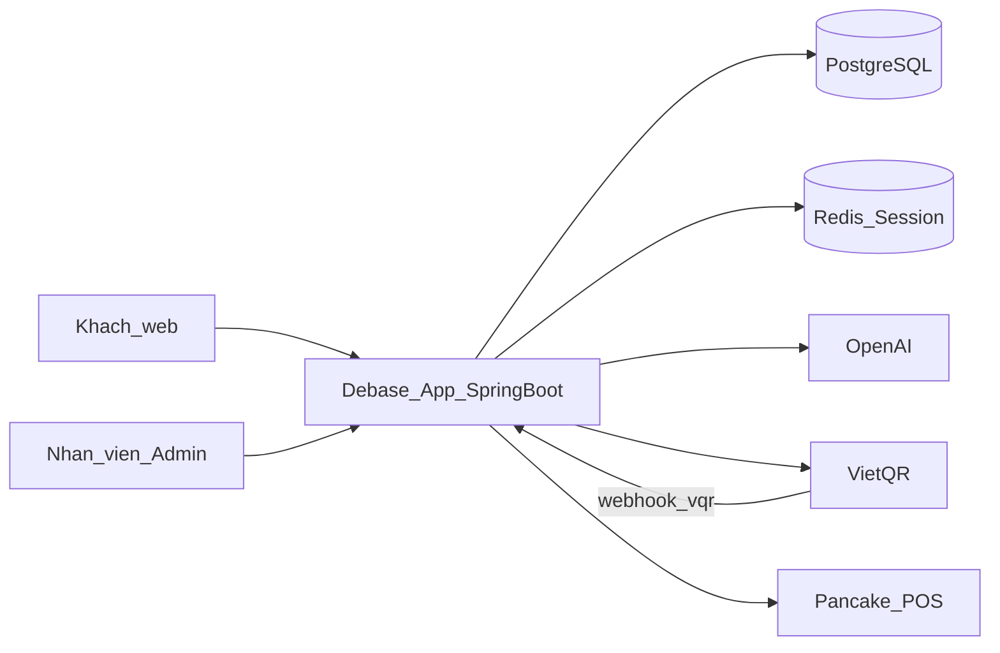

# DOC-ADD-01 — Kiến trúc tổng quan

| Mục | Giá trị |
|-----|---------|
| **Mã tài liệu** | DOC-ADD-01 |
| **Phiên bản** | 1.0 |
| **Ngày** | 2026-10-09 |
| **Đối tượng đọc** | SA, Dev, Ban kỹ thuật KH (mức overview) |
| **Liên quan** | DOC-UAT-01, DOC-DM-01, DOC-ICD-01, DOC-ICD-02 |

---

## 1. Mục đích

Mô tả kiến trúc **mức nghiệm thu / giao tiếp với KH** — không thay detail design nội bộ (DOC-DEV-02).

## 2. Sơ đồ ngữ cảnh

## 3. Phân lớp ứng dụng

| Lớp | Thành phần chính |
|-----|------------------|
| Presentation | Thymeleaf store (`templates/`), Admin AM/SA screens, static CSS/JS |
| API | REST: `/api/size-advice`, `/api/store-chat`, `/api/payment/**`, `/vqr/**`, `/add-to-cart` |
| Domain services | Product, Cart, Order, Payment (COD/VietQR), SizeAdvice, StoreChat |
| Integration | OpenAI client, VietQR API client, Pancake POS client |
| Persistence | JPA repositories, PostgreSQL; session/cart Redis |

## 4. Luồng nghiệp vụ chính (logic)

| Luồng | Điểm vào | Điểm ra |
|-------|----------|---------|
| Duyệt SP | `HomeController` group/search | HTML list/detail |
| Giỏ | `CartController` `/add-to-cart` | Session `cartForm` (+ DB nếu login) |
| COD | Payment checkout COD | Order + (Pancake) |
| VietQR | Tạo QR → webhook Transaction Sync | Order confirmed |
| Size AI | `/api/size-advice` | JSON recommended size |
| Store Chat | `/api/store-chat` | JSON message + product cards |

## 5. Bảo mật (tóm tắt)

- Storefront & API mua hàng: session user; Spring Security scoped theo prefix admin (`/AM/**`, `/SA/**`…).  
- `/vqr/**`: xác thực Partner Basic + JWT (xem DOC-ICD-01).  
- Admin: đăng nhập role quản trị.

## 6. Triển khai tham chiếu

Ứng dụng container (Docker) cùng PostgreSQL/Redis theo cấu hình dự án. Port và biến môi trường ghi trong runbook vận hành nội bộ — không nhân bản tại đây.
