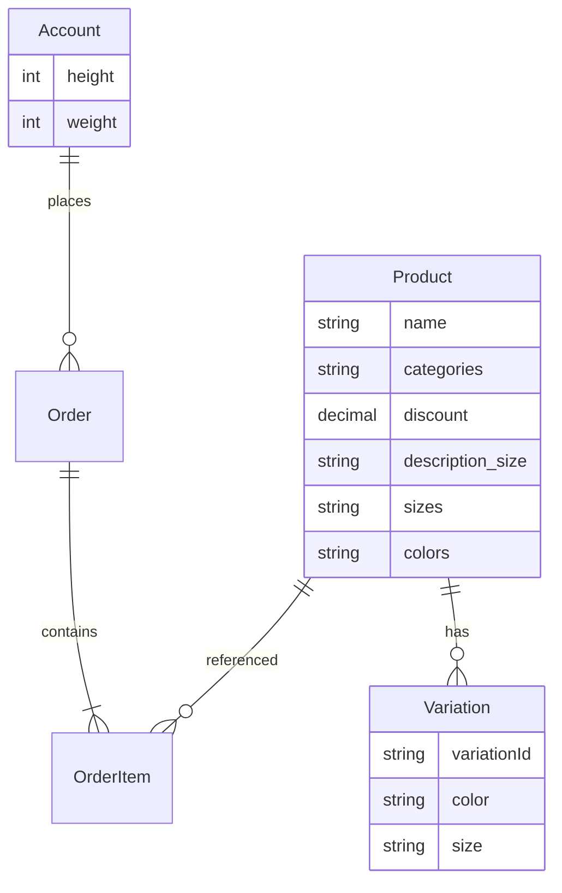

# DOC-DM-01 — Mô hình miền dữ liệu (Domain Model Overview)

| Mục | Giá trị |
|-----|---------|
| **Mã tài liệu** | DOC-DM-01 |
| **Phiên bản** | 1.0 |
| **Ngày** | 2026-10-09 |
| **Đối tượng đọc** | BA, SA, Dev |
| **Liên quan** | DOC-BRD-01, DOC-ADD-01 |

---

## 1. Mục đích

Mô tả **ý nghĩa nghiệp vụ** các thực thể chính. Không dump DDL đầy đủ.

## 2. Sơ đồ quan hệ (logic)

## 3. Thực thể trọng yếu

### Account (tài khoản thành viên)

| Thuộc tính nghiệp vụ | Ý nghĩa |
|----------------------|---------|
| Định danh / liên hệ | Đăng nhập, giao hàng |
| `height`, `weight` | Phục vụ tư vấn size (BR-08, BR-13) |

### Product (sản phẩm)

| Thuộc tính | Ý nghĩa nghiệp vụ |
|------------|-------------------|
| `name` | Hiển thị & search; Store Chat exact match |
| `categories` | NEW IN, BEST SELLER, TOP, BOTTOM… (BR-02, BR-03) |
| `discount` | % giảm; SALE khi > 0 (BR-01) |
| `price` / giá sau giảm | Hiển thị giá |
| `sizes`, `colors`, `types` | Chuỗi lựa chọn trên PDP / chat card |
| `description_size` | Bảng đo phục vụ AI size (BR-10, BR-13) |
| `image`… | Ảnh card / PDP |
| `productPancakeId` | Liên kết biến thể Pancake |
| `deleted` | Ẩn khỏi storefront khi true |

### Variation (SKU)

| Thuộc tính | Ý nghĩa |
|------------|---------|
| `variationId` | Khóa thêm giỏ |
| `color`, `size`, `type` | Khớp lựa chọn khách |
| `remainQuantity` | Tồn (tham chiếu) |
| `image` | Ảnh theo biến thể |

### Order / OrderItem / Payment

- **Order:** đơn sau checkout (COD hoặc sau VietQR sync).  
- **OrderItem:** dòng hàng (SP, variation, số lượng, giá).  
- **Payment / log giao dịch:** đối soát VietQR (AM010).

### Cart (session / DB)

- Guest: `cartForm` session.  
- Login: đồng bộ giỏ tài khoản.

## 4. Quy ước không trùng tài liệu

- Rule lọc SALE/NEW IN → chỉ [DOC-BRD-01](../business/DOC-BRD-01-business-rules.md).  
- Payload API VietQR → chỉ [DOC-ICD-01](../integrations/DOC-ICD-01-vietqr-callback.md).  
