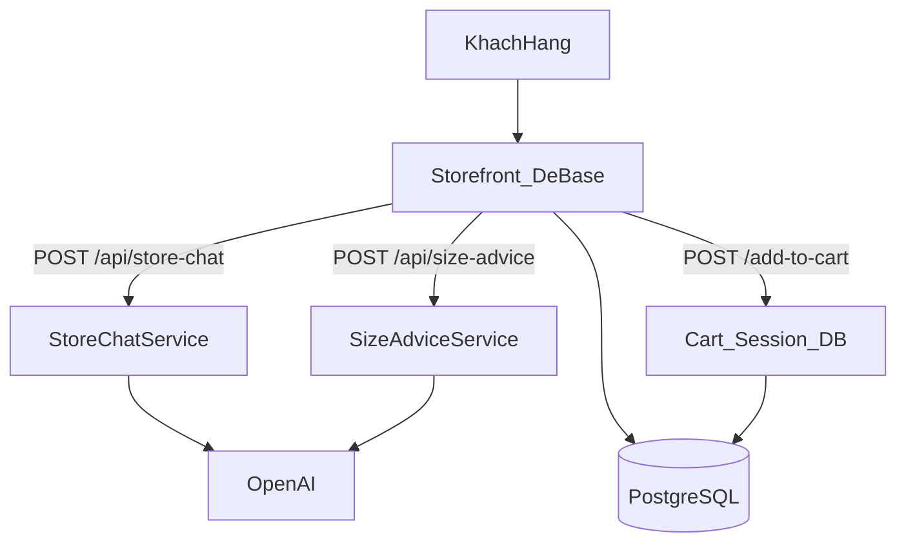

# TRƯỜNG ĐẠI HỌC CÔNG NGHỆ GIAO THÔNG VẬN TẢI

## KHOA CÔNG NGHỆ THÔNG TIN

---

# BÁO CÁO ĐỒ ÁN 1

## Đề tài: Chatbot AI tư vấn sản phẩm và kích thước trên hệ thống thương mại điện tử De Basé

---

| Mục | Nội dung |
|-----|----------|
| **Sinh viên thực hiện** | Trịnh Văn Hải |
| **Mã sinh viên** | 75DTTT41008 |
| **Lớp** | K75.4 |
| **Nhóm** | 1 |
| **Môn học** | Đồ án 1 |
| **Hệ thống thực tế** | De Basé (dragun-cloud) — https://debase.vn |
| **Mã tài liệu** | DOC-SYS-01 |
| **Phiên bản** | 1.0 |
| **Ngày hoàn thành** | 09/10/2026 |

---

## LỜI CAM ĐOAN

Em xin cam đoan báo cáo Đồ án 1 này là kết quả nghiên cứu và thực hiện của cá nhân trên hệ thống thương mại điện tử De Basé. Các nội dung tham khảo được trích dẫn đúng quy định. Em chịu trách nhiệm về tính trung thực của báo cáo.

Hà Nội, ngày 09 tháng 10 năm 2026

**Sinh viên**

Trịnh Văn Hải

---

## MỤC LỤC

1. [Mở đầu](#chương-1-mở-đầu)  
2. [Cơ sở lý thuyết và công nghệ](#chương-2-cơ-sở-lý-thuyết-và-công-nghệ)  
3. [Phân tích yêu cầu](#chương-3-phân-tích-yêu-cầu)  
4. [Kiến trúc hệ thống tổng quan](#chương-4-kiến-trúc-hệ-thống-tổng-quan)  
5. [Thiết kế và hiện thực Chatbot AI](#chương-5-thiết-kế-và-hiện-thực-chatbot-ai)  
6. [Kiểm thử và đánh giá](#chương-6-kiểm-thử-và-đánh-giá)  
7. [Kết luận và hướng phát triển](#chương-7-kết-luận-và-hướng-phát-triển)  
8. [Phụ lục](#phụ-lục)

---

## DANH MỤC TỪ VIẾT TẮT

| Viết tắt | Giải thích |
|----------|------------|
| AI | Artificial Intelligence — Trí tuệ nhân tạo |
| API | Application Programming Interface |
| BR | Business Rule — Quy tắc nghiệp vụ |
| FN | Function — Chức năng |
| LLM | Large Language Model — Mô hình ngôn ngữ lớn |
| PDP | Product Detail Page — Trang chi tiết sản phẩm |
| POS | Point of Sale |
| TC | Test Case — Kịch bản kiểm thử |
| UC | Use Case — Trường hợp sử dụng |
| UAT | User Acceptance Testing — Kiểm thử chấp nhận |

---

## DANH MỤC BẢNG

| Số bảng | Tên bảng |
|---------|----------|
| Bảng 1.1 | Đóng góp chính của chức năng AI |
| Bảng 3.1 | Yêu cầu chức năng trọng tâm AI |
| Bảng 3.2 | Quy tắc nghiệp vụ AI |
| Bảng 5.1 | So sánh hai kênh tư vấn AI |
| Bảng 5.2 | Hợp đồng API Store Chat |
| Bảng 6.1 | Ma trận kiểm thử AI |

---

# CHƯƠNG 1. MỞ ĐẦU

## 1.1. Bối cảnh đề tài

Thương mại điện tử thời trang đòi hỏi trải nghiệm tư vấn gần với nhân viên bán hàng: khách cần tìm đúng loại sản phẩm và chọn kích thước phù hợp trước khi quyết định mua. Website De Basé (https://debase.vn) đã có đầy đủ luồng duyệt danh mục, chi tiết sản phẩm, giỏ hàng và thanh toán. Tuy nhiên, hai nhóm khó khăn vẫn thường gặp:

1. Danh mục rộng (ví dụ nhóm TOP gồm áo phông, sơ mi, nỉ…) khiến khách khó lọc đúng loại món chỉ bằng menu.
2. Việc chọn size thiếu đối chiếu với bảng đo sản phẩm dẫn đến tỷ lệ đổi hàng hoặc bỏ mua cao hơn.

Đề tài **Chatbot AI** hướng tới bổ sung năng lực tư vấn tự động trên nền tảng hiện có, bám dữ liệu sản phẩm thật của cửa hàng.

## 1.2. Mục tiêu đề tài

1. Phân tích yêu cầu và quy tắc nghiệp vụ cho chatbot tư vấn sản phẩm và tư vấn size.
2. Thiết kế, hiện thực Store Chat toàn site và Size Advice trên trang chi tiết sản phẩm.
3. Đảm bảo kết quả tư vấn chính xác theo dữ liệu database (exact / similar, bảng đo size).
4. Kết nối tư vấn với hành vi mua hàng: xem chi tiết, thêm giỏ.
5. Xây dựng bộ kịch bản kiểm thử chấp nhận cho chức năng AI.

## 1.3. Đối tượng và phạm vi nghiên cứu

**Đối tượng:** Module Chatbot AI trên hệ thống De Basé (mã nguồn dragun-cloud).

**Phạm vi thực hiện:**

| Trong phạm vi | Ngoài phạm vi chi tiết |
|---------------|------------------------|
| Store Chat — `POST /api/store-chat` | Thiết kế sâu VietQR, Pancake POS |
| Size Advice — `/api/size-advice` | Toàn bộ chức năng Admin |
| Lọc exact/similar, tư vấn size | Ứng dụng mobile native |
| Widget chat FE, gắn giỏ hàng | Tối ưu hạ tầng Docker |

## 1.4. Phương pháp thực hiện

- Khảo sát luồng mua hàng và dữ liệu sản phẩm trên hệ thống thực tế.
- Phân tích yêu cầu theo Use Case và Business Rule.
- Thiết kế kiến trúc gắn LLM với lớp lọc catalog trên PostgreSQL.
- Hiện thực trên Spring Boot và kiểm thử theo kịch bản chấp nhận.

## 1.5. Đóng góp chính

**Bảng 1.1 — Đóng góp chính của chức năng AI**

| STT | Đóng góp | Mã quy tắc |
|-----|----------|------------|
| 1 | Lọc sản phẩm theo loại món (exact) trước khi LLM xếp hạng | BR-11 |
| 2 | Không có exact mới gợi ý tương tự và gắn nhãn rõ ràng | BR-12 |
| 3 | Tư vấn size từ bảng đo và hồ sơ số đo; không gắn size mặc định sai | BR-10, BR-13 |
| 4 | Kết nối kết quả tư vấn với PDP và thêm giỏ theo variation | BR-05 |

## 1.6. Cấu trúc báo cáo

Báo cáo gồm bảy chương: mở đầu; cơ sở lý thuyết; phân tích yêu cầu; kiến trúc tổng quan; thiết kế và hiện thực Chatbot AI (trọng tâm); kiểm thử; kết luận và hướng phát triển.

---

# CHƯƠNG 2. CƠ SỞ LÝ THUYẾT VÀ CÔNG NGHỆ

## 2.1. Chatbot trong thương mại điện tử

Chatbot bán hàng là hệ thống hội thoại hướng chuyển đổi: trả lời ngắn, đề xuất sản phẩm, rút ngắn đường đến giỏ hàng. Khác chatbot hỏi đáp chính sách thuần túy, chatbot thương mại phải:

- Chỉ đề xuất sản phẩm tồn tại trong cửa hàng.
- Tôn trọng quy tắc khuyến mãi và danh mục của website.
- Hỗ trợ chọn biến thể (màu, size) trước khi thêm giỏ.

## 2.2. Mô hình ngôn ngữ lớn và kiểm soát dữ liệu

Hệ thống sử dụng dịch vụ OpenAI (Chat Completions) để sinh câu trả lời tiếng Việt và hỗ trợ xếp hạng sản phẩm trong tập ứng viên. Để giảm đề xuất sản phẩm không tồn tại, kiến trúc áp dụng:

1. Truy vấn và lọc catalog trên cơ sở dữ liệu trước.
2. LLM chỉ được chọn `productId` thuộc catalog đã lọc.
3. Khi LLM lỗi hoặc hết hạn mức, hệ thống trả kết quả từ lớp lọc dữ liệu (fallback).

Cách tiếp cận này gọi là sinh nội dung bám catalog (catalog-grounded generation): ngôn ngữ do LLM tạo, tập sản phẩm do hệ thống kiểm soát.

## 2.3. Tư vấn kích thước trang phục

Tư vấn size dựa trên ba nguồn:

- Số đo khách hàng: chiều cao, cân nặng, giới tính.
- Bảng đo sản phẩm: trường `description_size`.
- Tập size còn bán: trường `sizes`.

Thứ tự độ rộng chuẩn: **S → M → L → XL → XXL**. Size dự phòng cho phong cách rộng hoặc oversize phải là size **lớn hơn** size vừa vặn, không được nhỏ hơn.

## 2.4. Công nghệ sử dụng

| Thành phần | Công nghệ |
|------------|-----------|
| Ứng dụng | Java, Spring Boot, Thymeleaf |
| Dữ liệu | PostgreSQL, Redis (session, giỏ hàng) |
| AI | OpenAI API (cấu hình `openai.*`) |
| Giao diện chat | HTML, CSS, JavaScript (`store-chat.js`) |
| Triển khai tham chiếu | Docker |

---

# CHƯƠNG 3. PHÂN TÍCH YÊU CẦU

## 3.1. Đối tượng sử dụng

| Actor | Nhu cầu liên quan AI |
|-------|----------------------|
| Khách (chưa đăng nhập) | Hỏi chatbot; được yêu cầu bổ sung chiều cao, cân nặng khi cần tư vấn size |
| Thành viên | Tái sử dụng `height`, `weight` đã lưu trên tài khoản |
| Quản trị viên | Chuẩn hóa `name`, `categories`, `discount`, `description_size` để lọc đúng |

## 3.2. Yêu cầu chức năng trọng tâm

**Bảng 3.1 — Yêu cầu chức năng trọng tâm AI**

| Mã | Mô tả | Use Case | Business Rule |
|----|-------|----------|---------------|
| FN-09 | Gợi ý size trên trang chi tiết sản phẩm | UC-05 | BR-10 |
| FN-10 | Chatbot stylist: tìm sản phẩm, tư vấn size, xem và thêm giỏ | UC-06 | BR-11, BR-12, BR-13 |

## 3.3. Quy tắc nghiệp vụ AI

**Bảng 3.2 — Quy tắc nghiệp vụ AI**

| Mã | Nội dung |
|----|----------|
| BR-10 | Size Advice dùng `description_size` và size có sẵn; `backupSize` phải lớn hơn size đề xuất theo thứ tự S→M→L→XL→XXL |
| BR-11 | Câu hỏi loại món cụ thể (ví dụ áo phông, sơ mi) → kết quả exact theo tên; không lấy cả danh mục TOP như kết quả đúng yêu cầu |
| BR-12 | Không có sản phẩm exact → thông báo không có; sau đó mới gợi ý tương tự và đánh dấu tương tự |
| BR-13 | Ưu tiên số đo: câu hỏi → request → tài khoản đăng nhập; thiếu thì hỏi thêm; size gợi ý phải thuộc `sizes` của sản phẩm |
| BR-08 | Tài khoản có thể lưu chiều cao (cm) và cân nặng (kg) |
| BR-05 | Thêm giỏ bắt buộc `variationId` khớp màu, size, type đã chọn |
| NFR-01 | Lỗi AI hoặc hết hạn mức không làm gián đoạn toàn trang; có thông báo hoặc fallback |

## 3.4. Use Case UC-05 — Gợi ý size trên trang chi tiết

**Tác nhân:** Khách / Thành viên  

**Điều kiện trước:** Đang ở trang chi tiết sản phẩm có `productId`.

**Luồng chính**

1. Người dùng mở form gợi ý size.
2. Hệ thống điền sẵn chiều cao, cân nặng nếu tài khoản đã có dữ liệu.
3. Người dùng gửi giới tính, chiều cao, cân nặng và tùy chọn phong cách mặc.
4. Hệ thống gọi dịch vụ tư vấn size, trả size đề xuất, lý do và size dự phòng (nếu có).
5. Người dùng có thể hỏi tiếp trong khung chat theo ngữ cảnh sản phẩm hiện tại.

**Ngoại lệ:** Thiếu trường bắt buộc → từ chối xử lý. Sản phẩm không tồn tại → báo lỗi.

## 3.5. Use Case UC-06 — Store Chat tư vấn sản phẩm

**Tác nhân:** Khách / Thành viên  

**Điều kiện trước:** Widget chat khả dụng trên storefront.

**Luồng chính (exact)**

1. Người dùng mở chatbot, nhập câu hỏi (ví dụ: “áo phông”).
2. Hệ thống phân loại intent và loại sản phẩm.
3. Hệ thống truy vấn và lọc exact theo tên.
4. LLM sinh lời tư vấn và sắp xếp trong tập exact.
5. Giao diện hiển thị tin nhắn và thẻ sản phẩm; người dùng xem chi tiết hoặc thêm giỏ.

**Luồng thay thế A — similar**

1. Tập exact rỗng.
2. Hệ thống thông báo không có sản phẩm đúng loại.
3. Hệ thống lấy gợi ý tương tự (cùng nhóm gợi ý, vẫn loại trừ loại lệch) và gắn nhãn tương tự.

**Luồng thay thế B — thiếu số đo**

1. Câu hỏi liên quan size nhưng chưa đủ chiều cao, cân nặng.
2. Hệ thống hỏi bổ sung; không gắn size mặc định không có căn cứ.

## 3.6. Ràng buộc phi chức năng

- Thời gian phản hồi phụ thuộc độ trễ dịch vụ OpenAI; giao diện có trạng thái đang trả lời.
- Không lưu khóa API trong tài liệu hoặc mã nguồn công khai.
- Sản phẩm trả về phải ở trạng thái chưa xóa (`deleted = false`).

---

# CHƯƠNG 4. KIẾN TRÚC HỆ THỐNG TỔNG QUAN

## 4.1. Ngữ cảnh hệ thống

De Basé phục vụ khách hàng qua storefront web và nhân viên qua Admin. Phân hệ AI gọi OpenAI. Dữ liệu sản phẩm, tài khoản, đơn hàng lưu PostgreSQL; phiên và giỏ hàng sử dụng Redis. Thanh toán VietQR và đồng bộ Pancake POS thuộc hệ thống nền, không phân tích sâu trong đề tài này.



## 4.2. Phân lớp ứng dụng — phần AI

| Lớp | Thành phần |
|-----|------------|
| Giao diện | Widget `store-chat.js`, CSS; modal gợi ý size trên `product-detail` |
| API | `StoreChatController`, `SizeAdviceController` |
| Nghiệp vụ | `StoreChatServiceImpl`, `SizeAdviceServiceImpl` |
| Tích hợp | `OpenAIService` / `OpenAIServiceImpl` |
| Dữ liệu | `ProductRepository`, `AccountRepository`, `VariationRepository` |

## 4.3. Mô hình dữ liệu liên quan AI

| Thực thể | Thuộc tính trọng yếu | Vai trò |
|----------|----------------------|---------|
| Product | `name`, `categories`, `discount`, `sizes`, `colors`, `description_size`, `image` | Exact/similar, SALE/NEW IN, size, thẻ sản phẩm |
| Account | `height`, `weight` | Prefill số đo (BR-08, BR-13) |
| Variation | `variationId`, `color`, `size`, `type` | Thêm giỏ từ thẻ chat |

## 4.4. Vị trí chatbot trong hành trình mua hàng

Chatbot không thay thế danh mục website mà rút ngắn hành trình: hỏi → nhận thẻ sản phẩm → chọn biến thể → thêm giỏ hoặc mở trang chi tiết → thanh toán theo quy trình cửa hàng hiện có.

---

# CHƯƠNG 5. THIẾT KẾ VÀ HIỆN THỰC CHATBOT AI

## 5.1. Tổng quan hai kênh tư vấn

**Bảng 5.1 — So sánh hai kênh tư vấn AI**

| Kênh | Điểm vào | Đầu ra | Phạm vi sản phẩm |
|------|----------|--------|------------------|
| Store Chat | Nút chat góc phải dưới (toàn site) | Tin nhắn + danh sách thẻ sản phẩm | Nhiều sản phẩm theo câu hỏi |
| Size Advice | Nút “Gợi ý size” trên trang chi tiết | Size đề xuất + hội thoại | Một `productId` |

Hai kênh dùng chung hạ tầng OpenAI và nguyên tắc bám dữ liệu sản phẩm; khác nhau về ngữ cảnh đầu vào.

## 5.2. Giao diện Store Chat

Thành phần giao diện:

- Nút mở/đóng cố định (FAB).
- Panel: lịch sử tin nhắn, ô nhập, chip gợi ý nhanh (Hàng mới, Sale, Bán chạy).
- Thẻ sản phẩm: ảnh, tên, giá, chọn màu/size/type, nút **Xem**, **Thêm giỏ**.
- Khi `similarSuggestion = true`: hiển thị nhãn “Gợi ý sản phẩm tương tự”.

Luồng phía trình duyệt: gửi `message`, `height`, `weight`, `conversationHistory` tới `/api/store-chat`; cập nhật số đo từ phản hồi; render thẻ từ mảng `products`.

## 5.3. Phân loại ý định (intent)

Thành phần `StoreChatServiceImpl` phân loại câu hỏi theo thứ tự ưu tiên:

1. SALE / giảm giá → lọc `discount > 0` (cùng quy tắc menu SALE).
2. NEW IN / hàng mới → `categories` chứa `NEW IN`.
3. BEST SELLER → category tương ứng.
4. **Loại món cụ thể** (áo phông, sơ mi, nỉ, jean, …) → tìm theo tên; không dừng ở việc lấy cả danh mục TOP.
5. Danh mục chung (TOP, BOTTOM, …) chỉ khi không xác định được loại món cụ thể.

Mỗi loại món gồm:

- `matchTokens`: từ khóa khớp tên (ví dụ: phông, tee, t-shirt).
- `excludeTokens`: từ khóa loại trừ (ví dụ: khi hỏi phông thì loại sơ mi, oxford).

## 5.4. Truy vấn hai lớp: exact và similar

### 5.4.1. Lớp exact

1. Truy vấn sản phẩm theo từng token khớp, gộp kết quả và loại trùng.
2. Giữ sản phẩm có tên chứa ít nhất một `matchToken`.
3. Loại sản phẩm có tên chứa `excludeToken`.
4. Áp dụng thêm điều kiện SALE, size, màu nếu có trong câu hỏi.

Nếu tập exact khác rỗng, đây là kết quả chính (`mode = EXACT`).

### 5.4.2. Lớp similar

Chỉ khi exact rỗng:

1. Thông báo không có sản phẩm đúng loại yêu cầu.
2. Lấy sản phẩm cùng nhóm gợi ý (ví dụ TOP), vẫn loại `excludeTokens`.
3. Đặt `similarSuggestion = true` để giao diện gắn nhãn.

### 5.4.3. Xếp hạng trong catalog

LLM có thể trả danh sách `productIds`. Hệ thống chỉ giữ mã thuộc catalog đã lọc và không bổ sung sản phẩm ngoài danh sách nhằm “đủ số lượng”, tránh lẫn loại.

## 5.5. Tích hợp OpenAI trong Store Chat

**Đầu vào prompt gồm:** intent, mode EXACT hoặc SIMILAR, thông số khách hàng (nếu có), lịch sử hội thoại rút gọn, catalog (id, tên, giá, sizes, categories, trích bảng đo).

**Đầu ra JSON mong đợi:** `reply`, `productIds`, `sizes` (ánh xạ productId → size gợi ý).

**Ràng buộc:** chỉ recommend id trong catalog; mode SIMILAR bắt buộc nêu rõ tính chất gợi ý thay thế.

**Fallback:** lỗi gọi LLM → dùng danh sách đã lọc từ database và câu trả lời nghiệp vụ mặc định.

## 5.6. Tư vấn size trong Store Chat

### Thứ tự lấy số đo

1. Phân tích câu hỏi (ví dụ `1m65`, `165cm`, `55kg`).
2. Trường `height`, `weight` trên request (client giữ qua phiên chat).
3. Tài khoản đăng nhập (`Account.height`, `Account.weight`).

### Quyết định size trên thẻ sản phẩm

- Đủ số đo: gắn `recommendedSize` (từ LLM nếu hợp lệ với `sizes`, hoặc bảng tham chiếu rồi ánh xạ vào size đang bán).
- Thiếu số đo: không gắn size mặc định; nội dung trả lời yêu cầu bổ sung chiều cao, cân nặng.
- Giao diện sắp size theo S → M → L → XL → XXL; chỉ tô sáng size được gợi ý.

## 5.7. Size Advice trên trang chi tiết sản phẩm

| Phương thức | Đường dẫn | Mô tả |
|-------------|-----------|--------|
| POST | `/api/size-advice` | Tư vấn size lần đầu theo form |
| POST | `/api/size-advice/chat` | Hỏi tiếp theo ngữ cảnh sản phẩm |
| POST | `/api/size-advice/save-profile` | Lưu height, weight khi đã đăng nhập |

**Đầu vào chính:** `productId`, `gender`, `height`, `weight`; tùy chọn `fitPreference`, `note`.

**Xử lý:** tải sản phẩm và bảng đo → gọi LLM → phân tích JSON → kiểm tra size có trong danh sách bán → hiệu chỉnh `backupSize` theo thứ tự tăng dần → trả về giao diện chat trên trang chi tiết.

Nếu người dùng đăng nhập, số đo có thể được cập nhật vào tài khoản trong luồng tư vấn; lỗi lưu không làm thất bại tư vấn.

## 5.8. Hợp đồng API Store Chat

**Đường dẫn:** `POST /api/store-chat`

**Bảng 5.2 — Hợp đồng API Store Chat**

**Request**

| Trường | Kiểu | Mô tả |
|--------|------|--------|
| message | string | Câu hỏi bắt buộc |
| height, weight | number | Số đo phiên (không bắt buộc) |
| gender | string | Không bắt buộc |
| conversationHistory | array | Lịch sử rút gọn |

**Response**

| Trường | Kiểu | Mô tả |
|--------|------|--------|
| message | string | Câu trả lời |
| products | array | Danh sách thẻ sản phẩm |
| similarSuggestion | boolean | `true` nếu nhánh gợi ý tương tự |
| needBodyInfo | boolean | `true` nếu còn thiếu số đo |
| height, weight | number | Số đo đã xác định để client giữ |

Mỗi phần tử trong `products` gồm: `id`, `name`, `image`, giá hiển thị, `detailUrl`, `colors`, `sizes`, `types`, `variations`, `recommendedSize`, trạng thái hết hàng.

## 5.9. Kết nối giỏ hàng từ thẻ chat

1. Người dùng chọn màu, size trên thẻ (bắt buộc nếu sản phẩm có size).
2. Client tìm variation khớp.
3. Gọi `POST /add-to-cart` với `OrderItem` gồm `id`, `variationId`, `name`, `quantity`, `price`, `image`, `option`.
4. Cập nhật số lượng túi trên header.

Nếu thiếu `variationId`, hệ thống điều hướng sang trang chi tiết để chọn đủ thuộc tính.

## 5.10. Đồng bộ với quy tắc website

| Hành vi chat | Cùng nguồn với |
|--------------|----------------|
| Hỏi hoặc chọn Sale | Menu SALE: `discount > 0` |
| Hỏi hoặc chọn hàng mới | Menu NEW IN: `categories` chứa `NEW IN` |
| Exact theo tên | Bộ lọc tên sản phẩm, siết bằng loại món |
| Size | Cùng nguyên tắc bảng đo như Size Advice |

---

# CHƯƠNG 6. KIỂM THỬ VÀ ĐÁNH GIÁ

## 6.1. Chiến lược kiểm thử

Áp dụng kiểm thử chấp nhận theo kịch bản, tập trung hành vi quan sát được trên giao diện và API. Mỗi mã TC ánh xạ tới Business Rule, Use Case và checklist nghiệm thu.

## 6.2. Ma trận kiểm thử AI

**Bảng 6.1 — Ma trận kiểm thử AI**

| Mã | Tình huống | Kỳ vọng | BR |
|----|------------|---------|-----|
| TC-08 | Chip Sale | Chỉ sản phẩm đang giảm giá | BR-01 |
| TC-09 | Chip NEW IN | Sản phẩm thuộc NEW IN | BR-02 |
| TC-10 | Size trên PDP | Backup không nhỏ hơn size đề xuất | BR-10 |
| TC-11 | Hỏi “áo phông” | Exact chỉ tee hoặc phông; không sơ mi | BR-11 |
| TC-12 | Hỏi “sơ mi” | Exact chỉ sơ mi | BR-11 |
| TC-13 | Không có exact | Báo không có và có nhãn tương tự | BR-12 |
| TC-14 | Có chiều cao, cân nặng | Có `recommendedSize` hợp lệ | BR-13 |
| TC-15 | Thiếu số đo | Hỏi bổ sung; không gắn size ảo | BR-13 |
| TC-16 | Thêm giỏ từ thẻ | Giỏ tăng đúng variation | BR-05 |
| TC-17 | Nút Xem | Mở đúng `/products?id=` | — |

## 6.3. Kịch bản trọng điểm

### TC-11 — Exact áo phông

- **Given:** catalog có sản phẩm tee hoặc phông và có sơ mi.  
- **When:** người dùng hỏi “áo phông”.  
- **Then:** thẻ exact chỉ tee hoặc phông; `similarSuggestion = false`.

### TC-13 — Similar

- **Given:** không còn sản phẩm khớp exact.  
- **When:** hỏi đúng loại đó.  
- **Then:** thông báo không có đúng loại; có nhãn gợi ý tương tự; không đưa loại bị loại trừ như kết quả exact.

### TC-14 và TC-15 — Size

- Có số đo → size gợi ý thuộc `sizes` của sản phẩm.  
- Không số đo → yêu cầu bổ sung chiều cao, cân nặng.

## 6.4. Dữ liệu kiểm thử tối thiểu

- Ít nhất một sản phẩm `discount > 0` và một sản phẩm `discount = 0`.
- Ít nhất một sản phẩm có `categories` chứa `NEW IN`.
- Ít nhất một sản phẩm tee hoặc phông và một sơ mi.
- Sản phẩm có `description_size` và danh sách size rõ ràng.
- Cấu hình OpenAI hợp lệ trên môi trường thử, hoặc ghi nhận fallback khi mất kết nối.

## 6.5. Rủi ro và biện pháp

| Rủi ro | Biện pháp |
|--------|-----------|
| Hết hạn mức OpenAI | Fallback danh sách từ database; thông báo thân thiện |
| Tên sản phẩm không chuẩn hóa | Bổ sung `matchTokens`; chuẩn hóa đặt tên sản phẩm |
| Thiếu `description_size` | Thông báo hạn chế tư vấn size; bổ sung dữ liệu vận hành |
| Thiếu variation | Chuyển sang trang chi tiết để chọn đủ thuộc tính |

---

# CHƯƠNG 7. KẾT LUẬN VÀ HƯỚNG PHÁT TRIỂN

## 7.1. Kết luận

Đề tài **Chatbot AI** trên hệ thống De Basé đã hoàn thành các nội dung chính của Đồ án 1:

1. Phân tích bài toán tư vấn sản phẩm và size trên storefront thời trang.
2. Thiết kế và hiện thực Store Chat với lọc exact và similar bám database; LLM bị giới hạn trong catalog.
3. Thiết kế Size Advice và tư vấn size trong chat dựa trên bảng đo và hồ sơ số đo.
4. Kết nối kết quả tư vấn với xem chi tiết sản phẩm và thêm giỏ hàng.
5. Xây dựng bộ kịch bản chấp nhận từ TC-08 đến TC-17.

Kết quả đáp ứng mục tiêu đề tài: chatbot hỗ trợ khách tìm đúng loại sản phẩm, nhận gợi ý size có căn cứ, và thực hiện thao tác mua nhanh trên website thực tế.

## 7.2. Hạn chế

- Chất lượng exact phụ thuộc cách đặt tên sản phẩm và dữ liệu category, discount.
- Chất lượng lời văn phụ thuộc mô hình và prompt; hệ thống đã siết tập sản phẩm nhưng chưa thay thế hoàn toàn biên tập thủ công.
- Hệ thống phụ thuộc dịch vụ OpenAI về độ trễ và hạn mức sử dụng.

## 7.3. Hướng phát triển

1. Bổ sung tìm kiếm ngữ nghĩa (embedding) song song với từ khóa.
2. Áp dụng tool-calling có kiểm soát để truy vấn tồn kho theo thời gian thực.
3. Đo lường chuyển đổi: tỷ lệ mở chat → thêm giỏ → tạo đơn.
4. Mở rộng đa ngôn ngữ đồng bộ với storefront.

## 7.4. Công việc đã hoàn thành theo yêu cầu môn học

| Hạng mục | Trạng thái |
|----------|------------|
| Khảo sát hệ thống thực tế De Basé | Hoàn thành |
| Phân tích yêu cầu FN-09, FN-10 | Hoàn thành |
| Thiết kế kiến trúc Chatbot AI | Hoàn thành |
| Hiện thực Store Chat và Size Advice | Hoàn thành |
| Kiểm thử theo kịch bản chấp nhận | Hoàn thành |
| Báo cáo Đồ án 1 | Hoàn thành |

---

# PHỤ LỤC

## Phụ lục A. Ví dụ phản hồi Store Chat

```json
{
  "message": "Có 3 món áo phông khớp yêu cầu. Bấm Xem để vào chi tiết hoặc Thêm giỏ để mua.",
  "similarSuggestion": false,
  "needBodyInfo": false,
  "height": 165,
  "weight": 55,
  "products": [
    {
      "id": 101,
      "name": "Logo Tee - Áo Phông Logo De Basé",
      "detailUrl": "/products?id=101",
      "recommendedSize": "M",
      "sizes": ["S", "M", "L", "XL"],
      "colors": ["BLACK", "WHITE"]
    }
  ]
}
```

## Phụ lục B. Ánh xạ mã nghiệp vụ

| Business Rule | Use Case | Function | Test Case |
|---------------|----------|----------|-----------|
| BR-10 | UC-05 | FN-09 | TC-10 |
| BR-11 | UC-06 | FN-10 | TC-11, TC-12 |
| BR-12 | UC-06 | FN-10 | TC-13 |
| BR-13 | UC-06 | FN-10 | TC-14, TC-15 |
| BR-05 | UC-06 | FN-10 | TC-16 |

## Phụ lục C. Thành phần mã nguồn chính

| Thành phần | Đường dẫn logic |
|------------|-----------------|
| API Store Chat | `vn.co.cake.ai.controller.StoreChatController` |
| Nghiệp vụ Store Chat | `vn.co.cake.ai.service.impl.StoreChatServiceImpl` |
| API Size Advice | `vn.co.cake.ai.controller.SizeAdviceController` |
| Nghiệp vụ Size Advice | `vn.co.cake.ai.service.impl.SizeAdviceServiceImpl` |
| OpenAI client | `vn.co.cake.ai.service.openai.OpenAIServiceImpl` |
| Widget giao diện | `static/js/store-chat.js`, `static/css/store-chat.css` |

## Phụ lục D. Thông tin sinh viên và đề tài

| Mục | Nội dung |
|-----|----------|
| Trường | Trường Đại học Công nghệ Giao thông Vận tải |
| Môn học | Đồ án 1 |
| Nhóm | 1 |
| Họ và tên | Trịnh Văn Hải |
| Mã sinh viên | 75DTTT41008 |
| Lớp | K75.4 |
| Đề tài | Chatbot AI |

---

**HẾT BÁO CÁO**
